# Architecture Diagrams for AI Chatbot Widget

This document provides comprehensive visual representations of the chatbot widget system architecture at multiple levels of abstraction.

---

## 1. System Context Diagram

The system context diagram shows how the chatbot widget interacts with external systems and users.

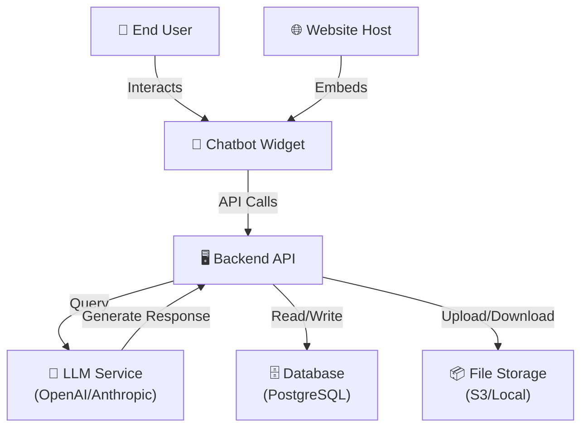

---

## 2. High-Level Architecture (HLA)

The HLA shows the major layers and components of the system.

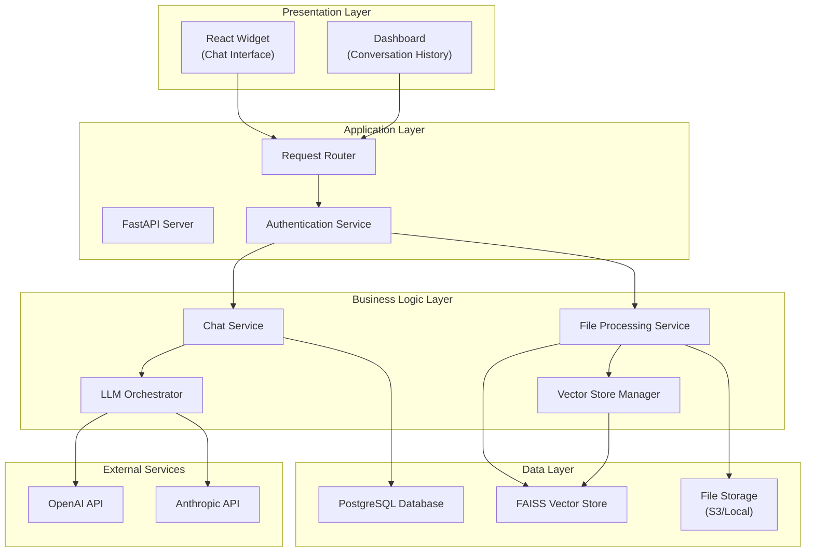

---

## 3. Component Architecture

This diagram shows the internal structure of the backend system.

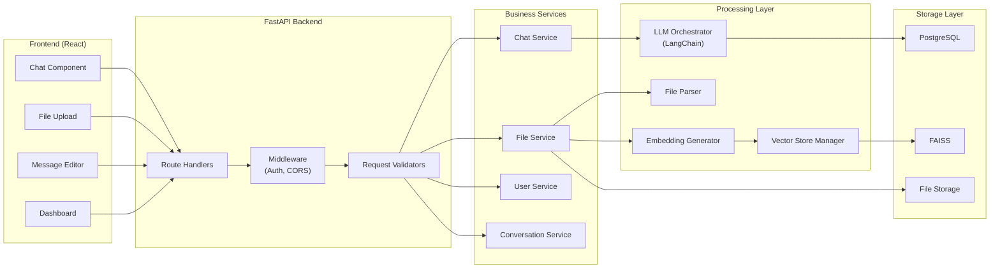

---

## 4. Data Flow Diagram (DFD)

The DFD illustrates how data flows through the system during a typical chat interaction.

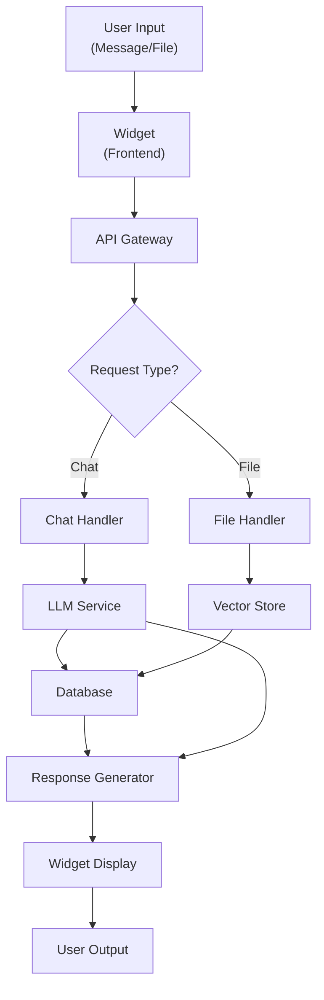

---

## 5. Deployment Architecture

This diagram shows how the system is deployed in production.

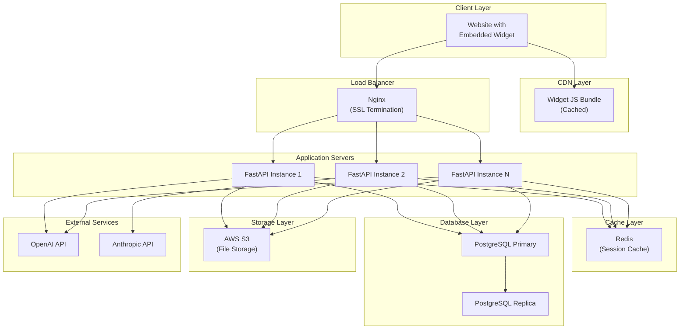

---

## 6. Widget Integration Architecture

This diagram shows how the widget integrates into an existing website.

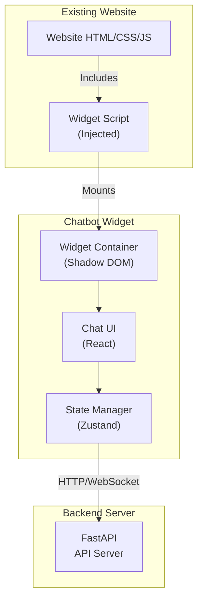

---

## 7. Message Flow Sequence Diagram

This diagram shows the sequence of interactions when a user sends a message.

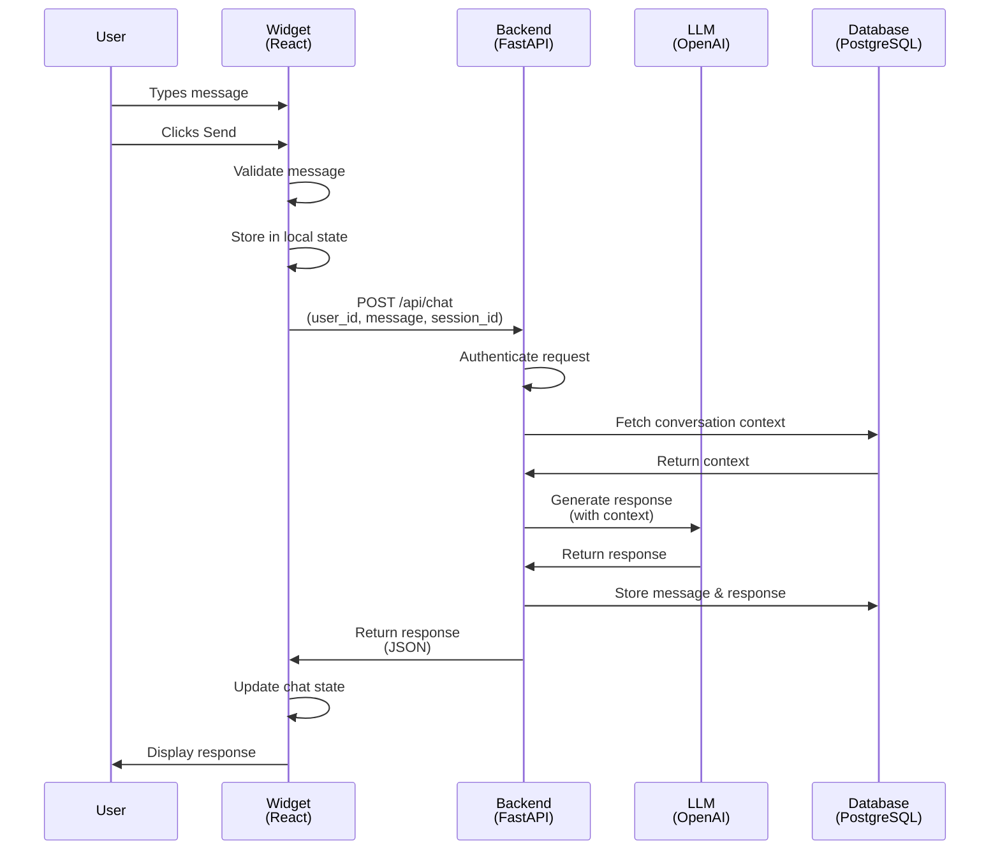

---

## 8. File Upload and Processing Flow

This diagram shows the detailed flow when a user uploads a file.

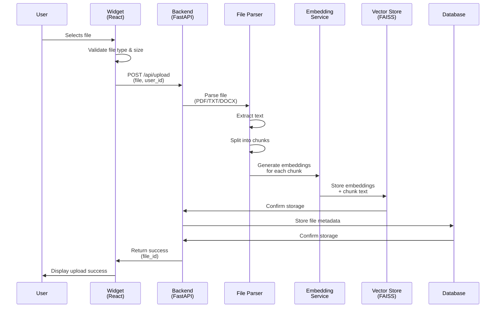

---

## 9. Edit Message Feature Flow

This diagram shows how the edit message feature works.

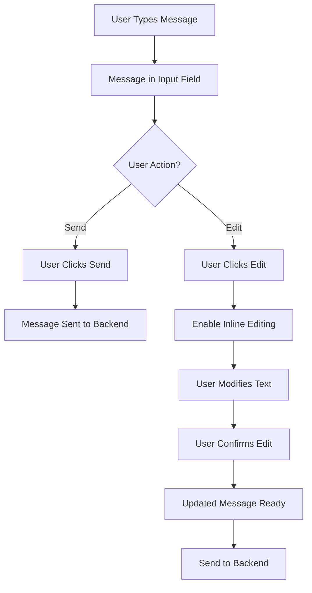

---

## 10. Dashboard Architecture

This diagram shows the structure of the conversation dashboard.

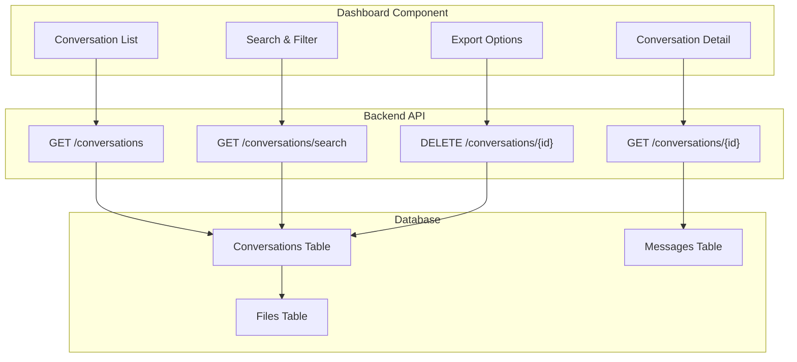

---

## 11. Security Architecture

This diagram shows the security layers in the system.

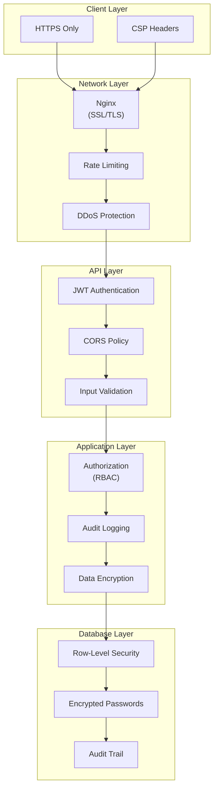

---

## 12. Scalability Architecture

This diagram shows how the system scales horizontally.

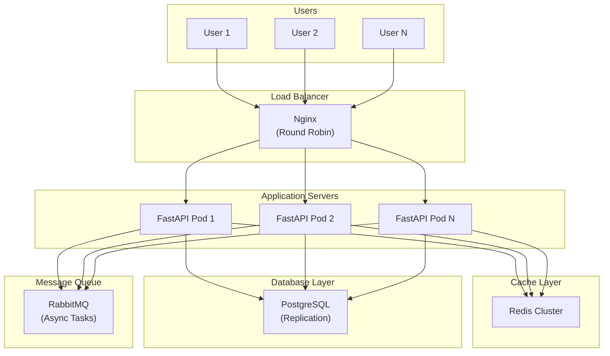

These architecture diagrams provide a comprehensive visual representation of the chatbot widget system at various levels of abstraction, from high-level system context to detailed component interactions.
