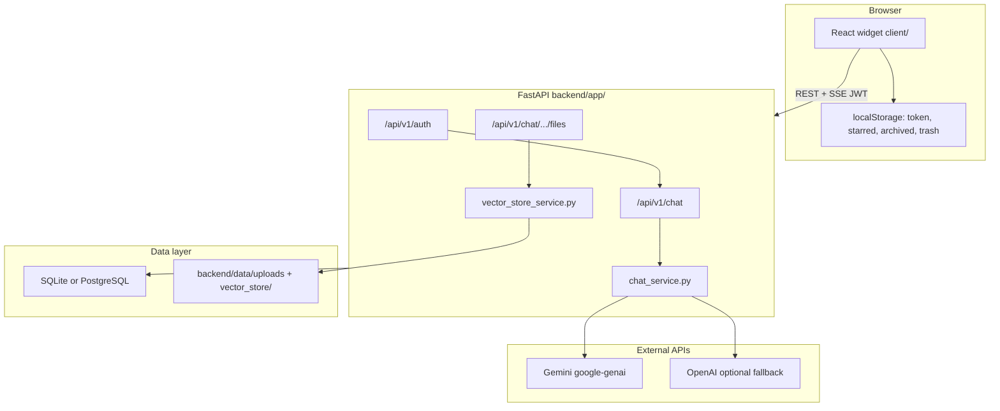

# System Overview

Executive summary of **Remi** — the embeddable AI chatbot widget in this monorepo. For code-level detail (lifecycle, RAG, auth, security), see [ARCHITECTURE.md](./ARCHITECTURE.md). For diagrams, see [02_architecture_diagrams.md](./02_architecture_diagrams.md).

---

## What the system is

Remi is a **self-contained React widget** plus a **FastAPI API** that provides:

- In-widget **signup / login** (JWT)
- **Streaming chat** (Server-Sent Events) powered primarily by **Google Gemini**
- **Document Q&A** via local **FAISS** + **sentence-transformers** (RAG)
- **File upload** (PDF, DOCX, XLSX, plain text) with background embedding
- **PDF generation** from chat intent or the Generate panel
- **Conversation history**, dashboard search/filter UI, and **mobile-responsive** expanded layout

There is **no** LangChain, Redis, Celery, WebSocket server, or moderation pipeline in the running application.

---

## High-level architecture



| Tier | Technology | Location |
|------|------------|----------|
| Frontend | React 18, TypeScript, Vite, Tailwind | `client/` |
| Backend | FastAPI, Uvicorn, SQLAlchemy 2 | `backend/app/` |
| Database | SQLite default; PostgreSQL optional | `DATABASE_URL` |
| Vectors | FAISS on disk per file | `backend/data/vector_store/` |
| LLM | Gemini 2.5 Flash (+ model fallbacks); OpenAI if configured | `chat_service.py` |

---

## Core workflows

### 1. Chat (streaming)

1. User sends message in `CompactWidget` or `ExpandedWidget`.
2. `streamSend.ts` optimistically adds user message; calls `streamMessage()` in `client/src/api/chat.ts` (`fetch` + `ReadableStream`).
3. `POST /api/v1/chat/conversations/{id}/messages/stream` saves the user message, streams assistant tokens as SSE.
4. Backend: `_prepare_assistant_context` → RAG (if processed files exist) → Gemini stream → single DB write for assistant message.
5. Final SSE event: JSON `{ "event": "done", ... }`; UI replaces placeholder message.

### 2. File upload → RAG

1. `POST /api/v1/chat/conversations/{id}/files` (multipart, max **100MB**).
2. File saved under `backend/data/uploads/`; DB row `status=pending`.
3. Background: daemon thread runs `process_file_embedding` → `extract_text` → `chunk_and_store` (FAISS).
4. Status becomes `processed` or `failed`; frontend polls every **3s** while any file is `pending`.

### 3. Document Q&A

1. On each message, `build_rag_context()` searches FAISS across processed files (`top_k=5`).
2. Chunks are injected into the Gemini prompt as `DOCUMENT CONTEXT` (Google Search disabled when RAG context is present).

### 4. PDF from chat

1. `detect_pdf_request()` matches natural language (must include “pdf”).
2. Backend generates markdown via Gemini; saves message with `has_pdf`, `pdf_content`, `pdf_filename`.
3. Frontend calls `jsPDF` via `pdfGenerator.ts`.

### 5. Generate panel

1. `POST /api/v1/chat/conversations/{id}/generate` with `type` (summary | report | analysis) and `format`.
2. Returns markdown/text JSON for client-side download (not server-rendered PDF bytes).

---

## Component map (actual)

### Frontend (`client/src/components/ChatbotWidget/`)

| Component | Role |
|-----------|------|
| `index.tsx` | Auth gate, shared state, compact/expanded routing |
| `RemiLauncher.tsx` | Floating open button (`RemiSphere` animation) |
| `WidgetAuthPanel.tsx` | Sign in / sign up |
| `CompactWidget.tsx` | 350px panel; expand control |
| `ExpandedWidget.tsx` | Full workspace; mobile tabs |
| `ChatInterface.tsx` | Messages, input, edit modal hook |
| `MobileTabBar.tsx` | Chat / Chats / Files on mobile |
| `MobileConversationList.tsx` | Conversation list + folder chips |
| `MobileFilesPanel.tsx` | Files + generate on mobile |
| `FileUploadModal.tsx` | Drag-and-drop upload |
| `FileGenerationPanel.tsx` | Summary / report / analysis export |
| `WidgetConversationDashboard.tsx` | Full conversation table/cards |
| `AssistantMarkdown.tsx` | Assistant message markdown |
| `MessageEditModal.tsx` | Edit + resend message |
| `FloatingWidget.tsx` | Re-export of `index.tsx` for `App.tsx` |
| `streamSend.ts` | Shared SSE send helper |

### Backend (`backend/app/`)

| Module | Role |
|--------|------|
| `main.py` | App factory, CORS, routes, table creation |
| `api/v1/auth.py` | signup, login, me |
| `api/v1/chat.py` | conversations, messages, stream, generate |
| `api/v1/files.py` | upload, list |
| `services/chat_service.py` | LLM, RAG, PDF detection, SSE |
| `services/vector_store_service.py` | Chunk, embed, FAISS search |
| `services/file_parser_service.py` | PDF/DOCX/XLSX/text extraction |
| `services/auth_service.py` | Users, JWT dependency |
| `core/security.py` | bcrypt + python-jose |
| `database/db.py` | SQLAlchemy models |

---

## Database schema (summary)

| Table | Purpose |
|-------|---------|
| `users` | email, bcrypt `hashed_password` |
| `conversations` | `user_id` FK, title |
| `messages` | role, content, optional PDF fields |
| `uploaded_files` | UUID id, path, `pending` / `processed` / `failed` |

Cascade deletes: user → conversations → messages & files. See [ARCHITECTURE.md §7](./ARCHITECTURE.md#7-database-schema).

---

## API surface (prefix `/api/v1`)

| Area | Endpoints |
|------|-----------|
| Auth | `POST /auth/signup`, `POST /auth/login`, `GET /auth/me` |
| Chat | CRUD `/chat/conversations`, `GET/POST .../messages`, `POST .../messages/stream`, `POST .../generate` |
| Files | `POST/GET .../conversations/{id}/files` |
| Public | `GET /`, `GET /health` |

Interactive docs: `http://localhost:8000/docs` when the API is running.

---

## Security (as implemented)

| Topic | Implementation |
|-------|----------------|
| Auth | JWT Bearer (`SECRET_KEY`, HS256, 8-day default expiry) |
| Passwords | bcrypt in `core/security.py` (not passlib) |
| Ownership | `get_conversation(id, user_id)` on all chat/file routes → 404 if wrong user |
| CORS | Explicit origins + optional `https://.*\.vercel\.app` regex |
| Upload limit | 100MB backend + middleware 413 |

**Not implemented:** rate limiting, RBAC, refresh tokens, email verification, content moderation API.

---

## Deployment (production)

| Layer | Typical target |
|-------|----------------|
| Frontend | **Vercel** (`VITE_API_URL` at build time) |
| Backend | **Railway** (`backend/Dockerfile`, `backend/railway.toml`) |
| Database | Managed PostgreSQL on host platform; SQLite for local dev only |

See [07_deployment_guide.md](./07_deployment_guide.md).

---

## Local setup (quick)

```bash
cp .env.example .env.local   # repo root — set GEMINI_API_KEY
cd backend && pip install -r requirements.txt
uvicorn app.main:app --reload --port 8000

npm ci                       # from repo root
npm run dev                  # http://127.0.0.1:5173 (runs client/)
```

Use `DATABASE_URL=sqlite:///./chatbot.db` for local dev without PostgreSQL.

---

## Related documentation

| Doc | Contents |
|-----|----------|
| [ARCHITECTURE.md](./ARCHITECTURE.md) | Implementation reference with file/line evidence |
| [03_features_capabilities.md](./03_features_capabilities.md) | Feature list: shipped vs not |
| [04_ml_ai_concepts.md](./04_ml_ai_concepts.md) | RAG/LLM concepts mapped to this repo |
| [05_project_structure(with_optional_enhancements).md](./05_project_structure(with_optional_enhancements).md) | Directory tree |
| [07_deployment_guide.md](./07_deployment_guide.md) | Deploy and env vars |
| [../README.md](../README.md) | Quick start and API reference |
