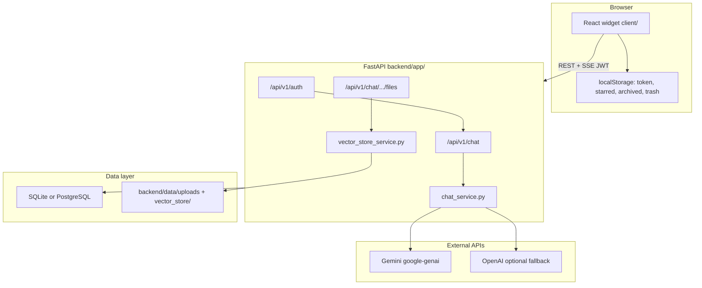

# System Overview

Executive summary of **Remi** ,the embeddable AI chatbot widget in this monorepo. For code-level detail (lifecycle, RAG, auth, security), see [ARCHITECTURE.md](./ARCHITECTURE.md). For diagrams, see [02_architecture_diagrams.md](./02_architecture_diagrams.md).

---

## What the system is

Remi is a **self-contained React widget** plus a **FastAPI API** that provides:

- In-widget **signup / login** (JWT)
- **Streaming chat** (Server-Sent Events) powered primarily by **Google Gemini**
- **Document Q&A** via **Gemini embeddings + pgvector** (keyword fallback when embedding fails)
- **File upload** (PDF, DOCX, XLS/XLSX, TXT, MD, CSV, JSON, LOG) with background extraction + embedding; vectors **persisted in PostgreSQL `embeddings` table**
- **Page-aware RAG** — "what's on page N" uses direct page retrieval; document-first routing before web search
- **PDF extraction** — PyMuPDF reads all pages; Gemini OCR for image-only pages (large flipbooks supported)
- **Security hardening** — required `SECRET_KEY`, prompt sanitization, MIME magic-byte validation, security headers, audit logging, auth rate limiting, per-user Gemini daily quota (UTC reset)
- **Response caching** — per-user in-process TTL cache for repeated questions (no Redis); `cache_hit` on assistant messages
- **File delete** — API + `FileListItem` UI with inline confirm and optimistic removal
- **PDF generation** from chat intent or the Generate panel
- **Conversation history**, dashboard **Search & Filter** UI (text, date, file, status filters), and **mobile-responsive** expanded layout
- **Visual identity** — dark launcher sphere with soft blue radial halo (`RemiFace.tsx`); file delete UX on desktop and mobile with optimistic UI + toast
- **Production deployment** — frontend on Vercel, API on Railway, `VITE_API_URL` + `CORS_ORIGINS` + `ENVIRONMENT=production` aligned

There is **no** LangChain, Redis, Celery, WebSocket server, or moderation pipeline in the running application.

---

## High-level architecture



| Tier | Technology | Location |
|------|------------|----------|
| Frontend | React 18, TypeScript, Vite, Tailwind | `client/` |
| Backend | FastAPI, Uvicorn, SQLAlchemy 2 | `backend/app/` |
| Database | SQLite default; PostgreSQL optional | `DATABASE_URL` |
| Vectors | Gemini `gemini-embedding-001` + pgvector in `embeddings` table | PostgreSQL (required in prod) |
| LLM | Gemini 2.5 Flash (+ model fallbacks); OpenAI if configured | `chat_service.py` |

---

## Core workflows

### 1. Chat (streaming)

1. User sends message in `CompactWidget` or `ExpandedWidget`.
2. `streamSend.ts` optimistically adds user message; calls `streamMessage()` in `client/src/api/chat.ts` (`fetch` + `ReadableStream`).
3. `POST /api/v1/chat/conversations/{id}/messages/stream` saves the user message, streams assistant tokens as SSE.
4. Backend: `_prepare_assistant_context` → document-first RAG (page lookup or semantic search) → tiered prompt → Gemini stream → single DB write for assistant message.
5. Final SSE event: JSON `{ "event": "done", ... }`; UI replaces placeholder message.

### 2. File upload → RAG

1. `POST /api/v1/chat/conversations/{id}/files` (multipart, max **100MB**).
2. File saved under `backend/data/uploads/`; DB row `status=pending`.
3. Background: daemon thread runs `process_file_embedding` → `extract_text` (PyMuPDF + OCR) → `chunk_and_store` (Gemini embed + pgvector).
4. Status progresses `pending` → `extracting` → `embedding` → `processed` / `failed`; `status_detail` shows progress (page counts, OCR status).
5. Frontend polls every **1.5s** while any file is still processing.

### 2b. File delete

1. User clicks trash on `FileListItem` → inline confirm.
2. `DELETE /api/v1/chat/conversations/{id}/files/{file_id}` — DB commit first (cascades `embeddings` rows), then disk cleanup.
3. UI optimistically removes the row; toast on success. Non-owner gets **403**.

### 3. Document Q&A

1. `_prepare_assistant_context()` runs on each message — **documents before web search**.
2. Pending files → polite wait message. Page queries → `get_page_content()` by `embeddings.page`.
3. Otherwise `build_rag_context()` runs pgvector cosine search (`top_k=5`).
4. `rag_quality_service.classify_rag_context()` sets prompt tier (DIRECT / PARTIAL / DEFLECTED / EMPTY).
5. Chunks injected as `DOCUMENT CONTEXT`; Google Search disabled when document context is used.
6. If RAG is empty and the question is clearly unrelated to uploaded filenames, web search is used instead.

### 4. PDF from chat

1. `detect_pdf_request()` matches natural language (must include “pdf”).
2. Backend generates markdown via Gemini; saves message with `has_pdf`, `pdf_content`, `pdf_filename`.
3. Frontend calls `jsPDF` via `pdfGenerator.ts`.

### 5. Generate panel

1. `POST /api/v1/chat/conversations/{id}/generate` with `type` (summary | report | analysis) and `format`.
2. Returns markdown/text JSON for client-side download (not server-rendered PDF bytes).

---

## Component map (actual)

### Frontend (`client/src/components/ChatbotWidget/`)

| Component | Role |
|-----------|------|
| `index.tsx` | Auth gate, shared state, compact/expanded routing |
| `RemiLauncher.tsx` | Floating open button (`RemiSphere` animation) |
| `WidgetAuthPanel.tsx` | Sign in / sign up |
| `CompactWidget.tsx` | 350px panel; expand control |
| `ExpandedWidget.tsx` | Full workspace; mobile tabs |
| `ChatInterface.tsx` | Messages, input, edit modal hook |
| `MobileTabBar.tsx` | Chat / Chats / Files on mobile |
| `MobileConversationList.tsx` | Conversation list + folder chips |
| `MobileFilesPanel.tsx` | Files + generate on mobile |
| `FileUploadModal.tsx` | Drag-and-drop upload; validation errors; no `accept` filter |
| `FileListItem.tsx` | File row with status (`extracting`/`embedding`), `status_detail` progress, inline delete |
| `NavTooltip.tsx` | Tooltips on nav buttons (desktop hover, mobile long-press) |
| `RateLimitBanner.tsx` | Gemini quota countdown (429) |
| `constants/uploadFormats.ts` | Shared supported extensions |
| `FileGenerationPanel.tsx` | Summary / report / analysis export |
| `WidgetConversationDashboard.tsx` | Full conversation table/cards |
| `AssistantMarkdown.tsx` | Assistant message markdown |
| `MessageEditModal.tsx` | Edit + resend message |
| `FloatingWidget.tsx` | Re-export of `index.tsx` for `App.tsx` |
| `streamSend.ts` | Shared SSE send helper |

### Backend (`backend/app/`)

| Module | Role |
|--------|------|
| `main.py` | App factory, CORS, body limits, lifespan (Cloudflare refresh), migrations |
| `api/v1/auth.py` | signup, login, me (+ login audit + rate limit on both) |
| `api/v1/chat.py` | conversations, messages, stream, generate |
| `api/v1/files.py` | upload, list, delete |
| `api/v1/admin.py` | `GET /admin/embedding-health` (user-scoped) |
| `services/chat_service.py` | LLM, document-first RAG routing, sanitization, PDF detection, SSE |
| `services/rag_quality_service.py` | RAG context quality classification |
| `services/vector_store_service.py` | Gemini embed, pgvector search, page retrieval, versioning |
| `services/audit_service.py` | Best-effort audit log writes |
| `services/auth_rate_limit_service.py` | Login/signup brute-force protection |
| `core/sanitizer.py` | Prompt-injection stripping |
| `services/file_parser_service.py` | PyMuPDF + Gemini OCR PDF/DOCX/XLSX/text extraction |
| `services/auth_service.py` | Users, JWT dependency |
| `core/security.py` | bcrypt + python-jose |
| `database/db.py` | SQLAlchemy models |

---

## Database schema (summary)

| Table | Purpose |
|-------|---------|
| `users` | email, bcrypt `hashed_password` |
| `conversations` | `user_id` FK, title |
| `messages` | role, content, optional PDF fields |
| `uploaded_files` | UUID id, path, `status`, `status_detail`, `pdf_page_count`, `indexed_page_count`, `embedding_model_version`; `pending` → `extracting` → `embedding` → `processed` / `failed` |
| `embeddings` | Per-chunk vectors: `chunk_text`, pgvector `embedding`, `page`, `chunk_index`, FK → `uploaded_files` |
| `audit_logs` | action, user_id, ip, metadata (best-effort) |
| `gemini_daily_usage` | per-user UTC daily Gemini call count |

Cascade deletes: user → conversations → messages & files. ER diagram: [02_architecture_diagrams.md §11](./02_architecture_diagrams.md#11-database-er-diagram-schema). Column reference: [ARCHITECTURE.md §7](./ARCHITECTURE.md#7-database-schema).

---

## API surface (prefix `/api/v1`)

| Area | Endpoints |
|------|-----------|
| Auth | `POST /auth/signup`, `POST /auth/login`, `GET /auth/me` |
| Chat | CRUD `/chat/conversations`, `GET/POST .../messages`, `POST .../messages/stream`, `POST .../generate` |
| Files | `POST/GET/DELETE .../conversations/{id}/files` |
| Admin | `GET /admin/embedding-health` (JWT, user-scoped) |
| Public | `GET /`, `GET /health` |

Interactive docs: `http://localhost:8000/docs` when the API is running.

---

## Security (as implemented)

| Topic | Implementation |
|-------|----------------|
| Auth | JWT Bearer (`SECRET_KEY`, HS256, 8-day default expiry) |
| Auth rate limit | 5 failed login/signup attempts/min per IP (in-memory) |
| Passwords | bcrypt in `core/security.py` (not passlib) |
| Sanitization | `core/sanitizer.py` before RAG/LLM |
| Ownership | `get_conversation(id, user_id)` → 404; file delete uses `require_conversation_access()` → **403** for non-owner |
| Audit logs | `audit_logs` table; background writes on key actions |
| CORS | Explicit origins + optional `https://.*\.vercel\.app` regex |
| Upload limit | 100MB per file; 52 MB request body on upload route; magic-byte MIME |
| Cloudflare | `CLOUDFLARE_ONLY` + 24h IP range refresh |

**Not implemented:** Redis-backed distributed rate limits, admin RBAC, refresh tokens, email verification, content moderation API, Sentry wiring. **Shipped:** per-user Gemini daily quota (100/day UTC) with 429 + `reset_at` UI countdown; per-user response cache.

---

## Deployment (production — live)

| Layer | URL / target |
|-------|----------------|
| Frontend | https://chatbot-widget-client.vercel.app |
| Backend API | https://chatbot-widgetclient-production.up.railway.app |
| Database | PostgreSQL on Railway; SQLite (`chatbot.db`) for local dev only |

Hardening complete: `VITE_API_URL` on Vercel, `ENVIRONMENT=production` on Railway, `CORS_ORIGINS` aligned. See [07_deployment_guide.md](./07_deployment_guide.md).

## Remaining work

| Item | Status |
|------|--------|
| Conversation Detail tabs (Messages / Files / Generated Files / Details) | Not built |
| Embeddable npm package (`build:lib` drop-in widget) | Not built |

---

## Local setup (quick)

```bash
cp .env.example .env.local   # repo root — set GEMINI_API_KEY
cd backend && pip install -r requirements.txt
uvicorn app.main:app --reload --port 8000

npm ci                       # from repo root
npm run dev                  # http://127.0.0.1:5173 (runs client/)
```

Use `DATABASE_URL=sqlite:///./chatbot.db` for local dev without PostgreSQL.

---

## Related documentation

| Doc | Contents |
|-----|----------|
| [ARCHITECTURE.md](./ARCHITECTURE.md) | Implementation reference with file/line evidence |
| [03_features_capabilities.md](./03_features_capabilities.md) | Feature list: shipped vs not |
| [04_ml_ai_concepts.md](./04_ml_ai_concepts.md) | RAG/LLM concepts mapped to this repo |
| [05_project_structure(with_optional_enhancements).md](./05_project_structure(with_optional_enhancements).md) | Directory tree |
| [07_deployment_guide.md](./07_deployment_guide.md) | Deploy and env vars |
| [../README.md](../README.md) | Quick start and API reference |
