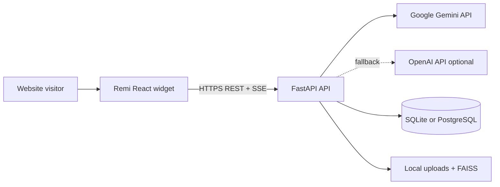
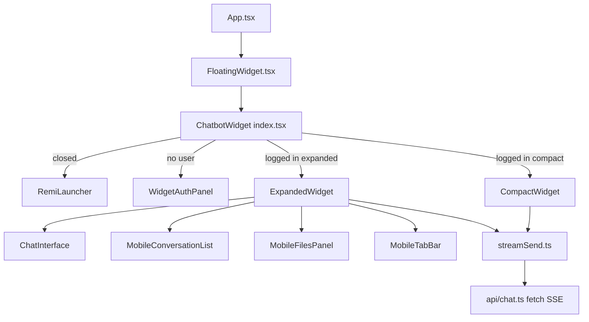
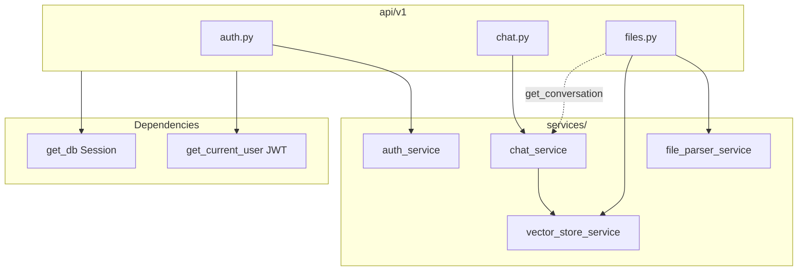
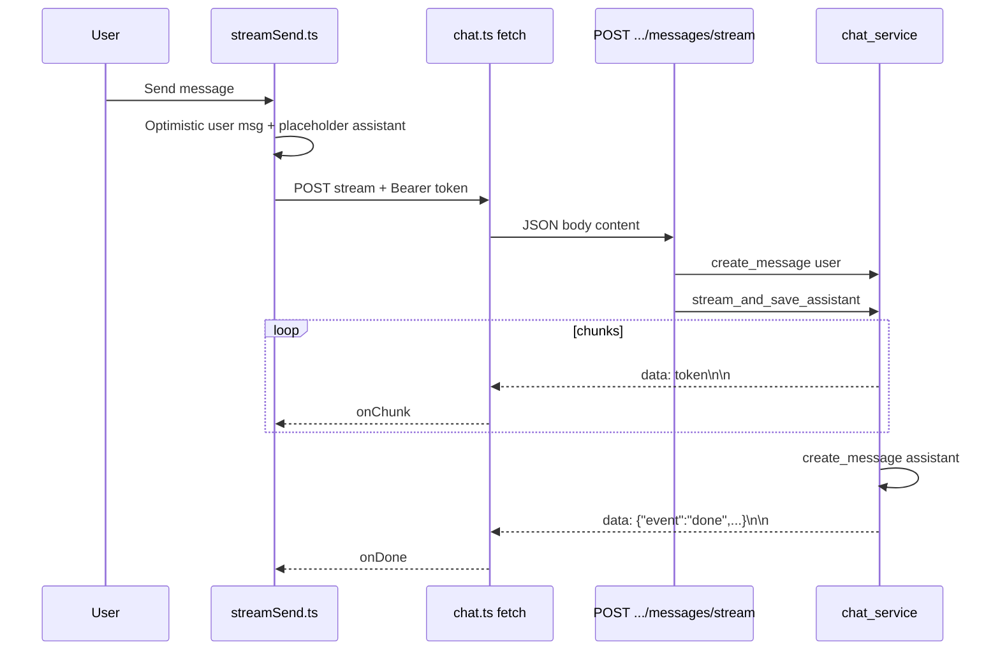
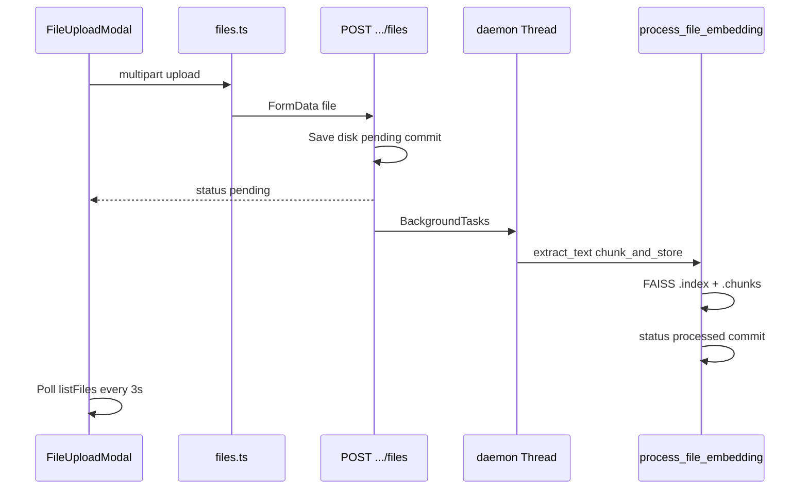
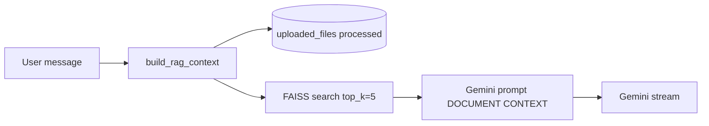
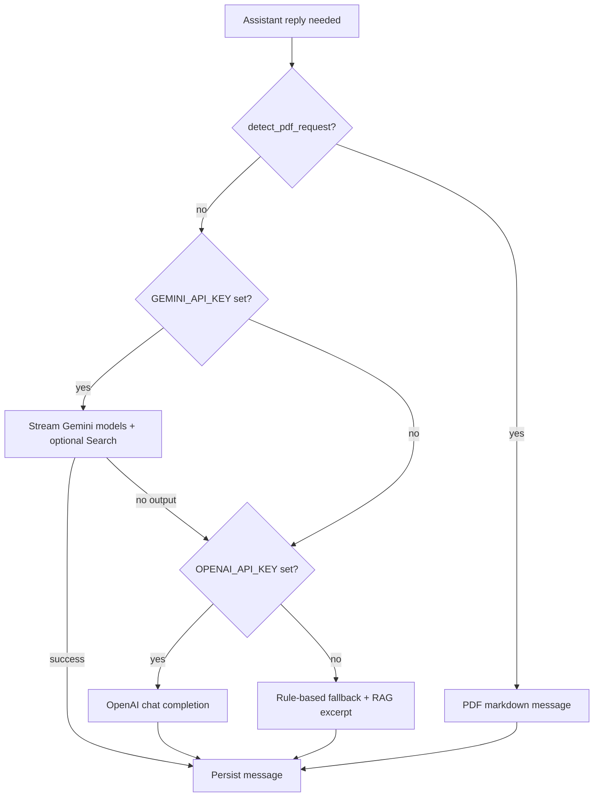
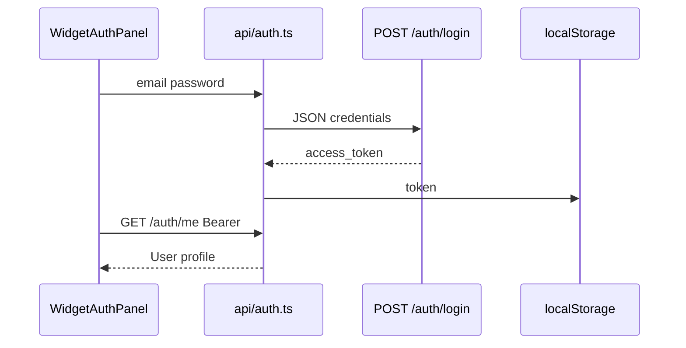
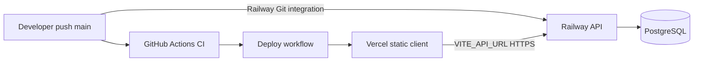
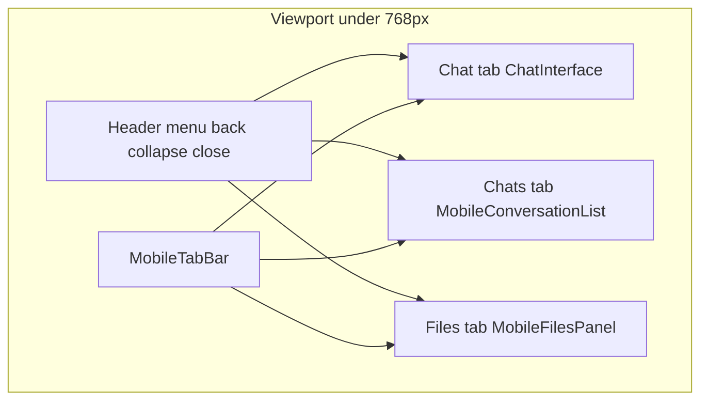

# Architecture Diagrams

Mermaid diagrams aligned with the **running codebase** (`client/` + `backend/app/`). Details: [ARCHITECTURE.md](./ARCHITECTURE.md).

---

## 1. System context

---

## 2. Frontend component flow

**State owner:** `ChatbotWidget/index.tsx` holds `messages`, `files`, `activeConversation`, `conversations`, folder IDs (`starred`, `archived`, `trash` in localStorage).

---

## 3. Backend request layers

---

## 4. Chat message sequence (SSE)

**Note:** There is no WebSocket; streaming uses **HTTP SSE** (`text/event-stream`).

---

## 5. File upload and embedding

---

## 6. RAG at query time

---

## 7. LLM fallback chain

---

## 8. Authentication flow

Subsequent requests: Axios interceptor and `fetch` add `Authorization: Bearer <token>`.

---

## 9. Deployment topology (typical)

Optional scaffold under `docker/kubernetes/` is **not** the primary documented path.

---

## 10. Mobile expanded layout

Desktop expanded: sidebar + chat + files (`md` / `lg` breakpoints).

---

## Diagram legend

| Symbol | Meaning |
|--------|---------|
| Solid arrow | Implemented today |
| Dotted arrow | Optional / fallback path |
| No Redis / RabbitMQ / LangChain | Not in runtime code |
