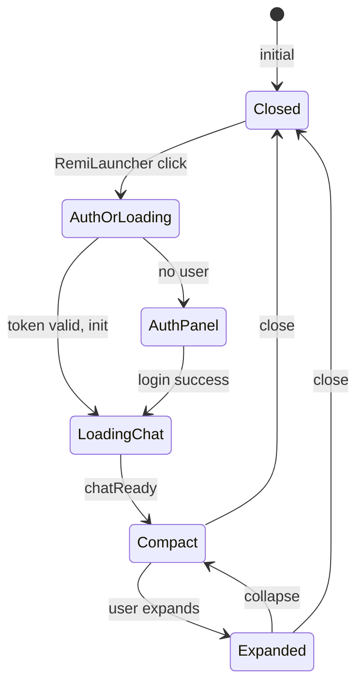
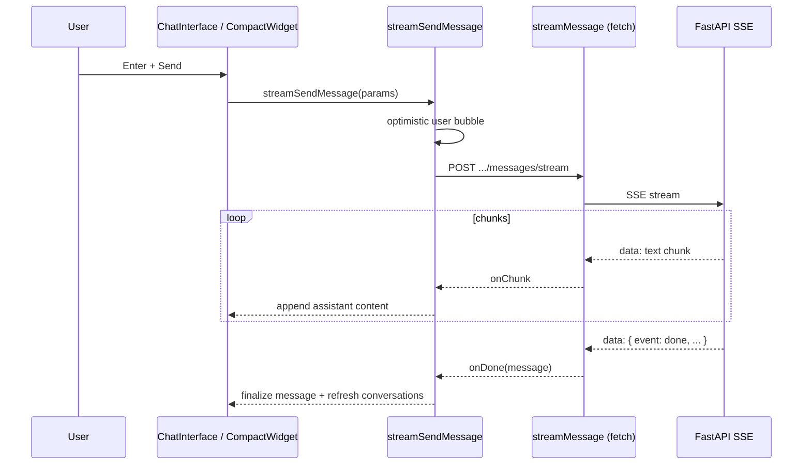

# Frontend Guide — React, TypeScript & Remi Widget

Code-level reference for the **Remi** chat widget in `client/`. This document explains how the React + TypeScript frontend is structured, which components exist, and which functions matter for chat, auth, files, and streaming.

**Related:** [ARCHITECTURE.md](./ARCHITECTURE.md) (full-stack) · [03_features_capabilities.md](./03_features_capabilities.md) (shipped UI features) · [01_system_overview.md](./01_system_overview.md)

---

## Table of contents

1. [Tech stack](#1-tech-stack)
2. [Entry points & build](#2-entry-points--build)
3. [Directory layout](#3-directory-layout)
4. [Widget shell & state flow](#4-widget-shell--state-flow)
5. [React concepts used](#5-react-concepts-used)
6. [TypeScript types](#6-typescript-types)
7. [API layer](#7-api-layer)
8. [Streaming (SSE)](#8-streaming-sse)
9. [Component reference](#9-component-reference)
10. [Hooks](#10-hooks)
11. [Utilities & local storage](#11-utilities--local-storage)
12. [Styling & UI primitives](#12-styling--ui-primitives)
13. [Important functions (quick index)](#13-important-functions-quick-index)
14. [Not yet built](#14-not-yet-built)

---

## 1. Tech stack

| Layer | Choice | Role in Remi |
|-------|--------|--------------|
| **UI library** | React 18 | Component tree, hooks, StrictMode |
| **Language** | TypeScript 5 | Props interfaces, API types, strict typing |
| **Bundler / dev server** | Vite 4 | Fast HMR, `import.meta.env`, production build |
| **Styling** | Tailwind CSS 3 | Utility classes, `prose` for markdown |
| **UI primitives** | Radix UI | Accessible dropdowns, popovers, dialogs (unstyled; styled with Tailwind) |
| **Icons** | lucide-react | Consistent icon set across widget |
| **HTTP (REST)** | axios | JSON API calls with auth interceptor |
| **HTTP (stream)** | `fetch` + `ReadableStream` | SSE chat streaming (not axios) |
| **Markdown** | react-markdown + remark-gfm | Assistant message rendering |
| **PDF (client)** | jsPDF | Download generated PDFs from chat or export panel |
| **Motion** | framer-motion | Available in deps; launcher uses CSS animations |
| **Toasts** | sonner | Success/error feedback (file delete, exports) |

The widget is **self-contained**: auth, chat, uploads, and exports all run inside the floating panel. The host page (`App.tsx`) only mounts `<ChatbotWidget />`.

---

## 2. Entry points & build

```
main.tsx
  └── ErrorBoundary (class component)
        └── App.tsx
              └── FloatingWidget.tsx  →  re-exports ChatbotWidget from index.tsx
```

| File | Purpose |
|------|---------|
| `client/src/main.tsx` | `ReactDOM.createRoot`, StrictMode, global CSS import |
| `client/src/App.tsx` | Minimal host page; mounts widget only |
| `client/vite.config.ts` | React plugin, path aliases (`@`, `@components`, `@hooks`), reads `VITE_API_URL` from repo-root `.env*` |
| `client/src/vite-env.d.ts` | Vite client types |

**Scripts** (`client/package.json`):

```bash
npm run dev          # Vite on http://127.0.0.1:5173
npm run build        # Production bundle → client/dist
npm run type-check   # tsc --noEmit
```

**Environment:** `VITE_API_URL` (default `http://localhost:8000`) — baked at build time for Vercel.

---

## 3. Directory layout

```
client/src/
├── api/                    # Backend HTTP clients
│   ├── client.ts           # axios instances (api + upload)
│   ├── auth.ts             # signup, login, logout, getMe
│   ├── authToken.ts        # JWT from localStorage
│   ├── chat.ts             # conversations, messages, SSE stream
│   ├── files.ts            # upload, list, delete
│   └── rateLimit.ts        # RateLimitError + 429 parsing
├── components/
│   ├── ErrorBoundary.tsx
│   ├── SearchFilterPanel.tsx
│   └── ChatbotWidget/      # All widget UI (see §9)
├── constants/
│   └── uploadFormats.ts    # Allowed extensions, 100MB cap
├── hooks/
│   └── useIsMobile.ts      # Responsive breakpoints
├── types/
│   ├── index.ts            # Conversation, Message, UploadedFile, User
│   └── chat.ts             # TMessageSource, TExternalLink
├── utils/                  # PDF, export, download, localStorage helpers
├── styles/
│   └── index.css           # Tailwind directives + widget animations
├── App.tsx
└── main.tsx
```

---

## 4. Widget shell & state flow

`ChatbotWidget` (`components/ChatbotWidget/index.tsx`) is the **root state owner**. It does not use Redux or Zustand — all state is React `useState` + `useRef` lifted here and passed down as props.

### Render modes (mutually exclusive)



| State | UI shown |
|-------|----------|
| `!isOpen` | `RemiLauncher` (floating sphere) |
| `!authChecked` | “Loading…” placeholder |
| `!user` | `WidgetAuthPanel` |
| `!chatReady` | “Loading chat…” |
| `isExpanded` | `ExpandedWidget` (full workspace) |
| else | `CompactWidget` (~350px panel) |

### Core state in `index.tsx`

| State / ref | Type | Purpose |
|-------------|------|---------|
| `user` | `User \| null` | Logged-in user from `getMe()` |
| `conversations` | `Conversation[]` | Sidebar / dashboard list |
| `activeConversation` | `Conversation \| null` | Current thread |
| `messages` | `Message[]` | Active conversation messages |
| `files` | `UploadedFile[]` | Active conversation uploads |
| `starredIds` / `archivedIds` / `trashedIds` | `Set<string>` | Client-side folders (localStorage) |
| `streamControllerRef` | `AbortController \| null` | Cancel in-flight SSE |
| `hasUnread` | `boolean` | Blue dot on launcher when closed |

### Key lifecycle effects

1. **Auth on mount** — read `localStorage.token` → `getMe()` or clear invalid token.
2. **Chat init** — when `user` set: `getConversations()` → load first or `createConversation('New Chat')`.
3. **File polling** — while any file has status `pending` \| `extracting` \| `embedding`, poll `listFiles` every **1.5s** (max 5 min).
4. **Unread tracking** — count assistant messages while widget closed.
5. **Cleanup** — `abortActiveStream()` on unmount and conversation switch.

`sharedProps` bundles conversation data + handlers passed to both `CompactWidget` and `ExpandedWidget`.

---

## 5. React concepts used

### Functional components + hooks

Almost every file is a function component. Patterns:

| Pattern | Where | Why |
|---------|-------|-----|
| `useState` | All interactive components | Local UI state (input, modals, loading) |
| `useRef` | `streamSend`, `CompactWidget`, `index.tsx` | Double-send guard (`isSendingRef`), scroll anchor, `AbortController` |
| `useCallback` | `index.tsx` handlers | Stable callbacks for child memoization / effect deps |
| `useEffect` | Polling, auth, scroll-to-bottom, rate-limit timer | Side effects tied to props/state |
| `useMemo` | `SearchFilterPanel`, dashboard | Derived filter validation / row lists |

### Lifting state up

Messages and files live in `index.tsx`. Children call `onMessagesChange` / `onFilesChange` (React `Dispatch<SetStateAction<…>>`) so streaming can append chunks without prop drilling individual setters.

### Optimistic UI

- **Send message:** user bubble added immediately in `streamSendMessage` before SSE completes.
- **Rename conversation:** title updated locally before `PATCH` returns.
- **Delete file:** `FileListItem` removes optimistically after API success.

### Class component (one)

`ErrorBoundary` — catches render errors at app root; shows stack trace in dev-friendly panel.

### No global store

Starred / archived / trashed conversation IDs use **localStorage** utilities, not the server. Search filters are local to `WidgetConversationDashboard`.

---

## 6. TypeScript types

### `types/index.ts`

```typescript
interface Conversation {
  id: string;
  title: string;
  created_at: string;
}

interface Message {
  id: string;
  role: 'user' | 'assistant';
  content: string;
  created_at: string;
  has_pdf?: boolean;
  pdf_content?: string | null;
  pdf_filename?: string | null;
  cache_hit?: boolean;
  source?: 'document' | 'both' | 'web' | 'none' | 'catalog' | null;
  links?: TExternalLink[];
}

interface UploadedFile {
  id: string;
  filename: string;
  status: 'pending' | 'extracting' | 'embedding' | 'processed' | 'failed';
  processing_error?: string | null;
  status_detail?: string | null;
  // ...
}

const FILE_IN_PROGRESS_STATUSES = ['pending', 'extracting', 'embedding'];
```

### `types/chat.ts`

- `TMessageSource` — `'document' | 'both' | 'web' | 'none'` (drives source badge in `MessageBubble`)
- `TExternalLink` — `{ url, title }` for web citations

### Props typing

Each major component exports a `*Props` interface (e.g. `ChatInterfaceProps`, `CompactWidgetProps`). API modules duplicate slim `Conversation` / `Message` shapes where needed and normalize server IDs to `string`.

---

## 7. API layer

### `api/client.ts`

Two axios instances share a JWT request interceptor:

| Client | Timeout | Use |
|--------|---------|-----|
| `apiClient` | 15s | JSON CRUD |
| `uploadClient` | 180s | Multipart file upload |

Base URL: `${VITE_API_URL}/api/v1`

### `api/authToken.ts`

```typescript
getAuthToken()      // localStorage 'token'
authHeaders(extra)  // { Authorization: Bearer … } for fetch + axios
```

Must match `login()` storage key in `auth.ts`.

### `api/auth.ts`

| Function | Endpoint | Notes |
|----------|----------|-------|
| `signup(email, password)` | `POST /auth/signup` | Does not store token |
| `login(email, password)` | `POST /auth/login` | Stores `access_token` → `localStorage.token` |
| `logout()` | — | Removes token |
| `getMe()` | `GET /auth/me` | Returns `User` |

### `api/chat.ts`

| Function | Purpose |
|----------|---------|
| `getConversations()` | List threads |
| `getConversationMessages(id)` | Message history |
| `createConversation(title)` | New thread |
| `renameConversation(id, title)` | PATCH title |
| `deleteConversation(id)` | DELETE thread |
| `sendMessage(id, content)` | Non-stream POST (used by message edit) |
| `streamMessage(id, content, handlers, signal?)` | SSE stream via `fetch` |
| `generateConversationFile(id, payload)` | Summary/report/analysis export |
| `getConversationDetail(id)` | **Defined but unused** in UI |

### `api/files.ts`

| Function | Purpose |
|----------|---------|
| `uploadFile(conversationId, file)` | `FormData` multipart; maps 401/413/415 to user strings |
| `listFiles(conversationId)` | Poll target during indexing |
| `deleteFile(conversationId, fileId)` | Remove upload |

### `api/rateLimit.ts`

- `RateLimitError` — `retryAfterSeconds` from body or `Retry-After` header
- `readRateLimitFromResponse(response)` — used when stream returns **429**

---

## 8. Streaming (SSE)

Chat replies use **Server-Sent Events** over `POST`, not WebSockets.

### Flow

```
User submits
  → streamSendMessage()          # streamSend.ts
      → optimistic user Message
      → streamMessage()          # chat.ts
          → fetch(POST …/messages/stream)
          → ReadableStream reader
          → parse SSE blocks (data: …)
          → onChunk(text)        # append to temp assistant id
          → onDone(message)      # replace with server message + metadata
```

### `streamSendMessage` guards

- Skips if empty content, `isTyping`, or `isSendingRef.current`
- Sets `isSendingRef` for entire request (prevents double-submit / StrictMode races)
- Registers `AbortController` in `streamControllerRef`
- On `RateLimitError`: calls `onRateLimit(seconds)` → `RateLimitBanner`
- On other errors: removes partial assistant bubble
- On `has_pdf`: triggers `generatePDFFromContent()` client-side download

### SSE parsing (`parseSsePayload`)

- Plain text lines → streaming chunks
- JSON with `event: 'done'` → final `Message` with `source`, `links`, `cache_hit`, PDF fields

---

## 9. Component reference

### Shell & layout

| Component | File | Role |
|-----------|------|------|
| **RemiLauncher** | `RemiLauncher.tsx` | Fixed bottom-right button; unread dot |
| **RemiSphere** / **RemiFace** | `RemiSphere.tsx`, `RemiFace.tsx` | Animated dark sphere + blue halo |
| **RemiAvatar2D** | `RemiAvatar2D.tsx` | Static avatar in headers / auth |
| **CompactWidget** | `CompactWidget.tsx` | ~350px chat panel; expand / close / logout |
| **ExpandedWidget** | `ExpandedWidget.tsx` | Full workspace: sidebar, dashboard, mobile tabs |
| **WidgetAuthPanel** | `WidgetAuthPanel.tsx` | Sign up / sign in inside widget |

### Chat UI

| Component | File | Role |
|-----------|------|------|
| **ChatInterface** | `ChatInterface.tsx` | Main message list, input (2000 char cap), header actions, date dividers |
| **MessageBubble** | `MessageBubble.tsx` | User vs assistant styling; source badge; external links |
| **AssistantMarkdown** | `AssistantMarkdown.tsx` | GFM markdown via `react-markdown` |
| **MessageEditModal** | `MessageEditModal.tsx` | Edit user message → `sendMessage` (non-stream) + undo stack |
| **RateLimitBanner** | `RateLimitBanner.tsx` | Countdown when daily Gemini quota hit |
| **NavTooltip** | `NavTooltip.tsx` | Radix tooltip provider for icon buttons |

### Files & generation

| Component | File | Role |
|-----------|------|------|
| **FileUploadModal** | `FileUploadModal.tsx` | Drag-drop; validates extension via `uploadFormats.ts` |
| **FileListItem** | `FileListItem.tsx` | Status labels, inline delete confirm, `processing_error` |
| **FileGenerationPanel** | `FileGenerationPanel.tsx` | Generate summary/report/analysis + export TXT/PDF/JSON/… |
| **MobileFilesPanel** | `MobileFilesPanel.tsx` | Files tab on small screens |

### Dashboard & mobile

| Component | File | Role |
|-----------|------|------|
| **WidgetConversationDashboard** | `WidgetConversationDashboard.tsx` | Search, filters, starred/archived/trash tabs |
| **SearchFilterPanel** | `SearchFilterPanel.tsx` | Text, date range, file/status filters (Radix popover) |
| **MobileTabBar** | `MobileTabBar.tsx` | Chat / Chats / Files / Generate tabs |
| **MobileConversationList** | `MobileConversationList.tsx` | Conversation picker on mobile |

### `ChatInterface` highlights

- **Header:** editable title, share menu, delete conversation (dropdown)
- **Messages:** grouped by day (`Today` / `Yesterday`); `MessageBubble` per row
- **Input:** Paperclip → upload modal; Send; Mic button is a **disabled stub**
- **Props:** `embedded`, `mobileLayout`, `rateLimitSeconds`, `uploadedFileCount`

### `ExpandedWidget` views

Internal `view` state: `'chat' | 'dashboard'`

- Desktop: left sidebar (conversations + files + generate panel)
- Mobile (`useIsMobile`): tab bar switches chat / list / files / generate

---

## 10. Hooks

### `hooks/useIsMobile.ts`

| Export | Media query |
|--------|-------------|
| `useMediaQuery(query)` | Generic `matchMedia` subscription |
| `useIsMobile()` | `max-width: 767px` |
| `useIsTablet()` | `768px – 1023px` |
| `useIsDesktop()` | `min-width: 1024px` |

Used by `ExpandedWidget`, `ChatInterface`, `SearchFilterPanel` for layout switches.

---

## 11. Utilities & local storage

### Export & download

| Module | Key exports |
|--------|-------------|
| `utils/exportConversation.ts` | `buildExportTxt/Md/Json/Html`, `exportPdf`, `exportCsv`, `downloadMarkdownAsPdf` |
| `utils/pdfGenerator.ts` | `generatePDFFromContent(markdown, filename)` — jsPDF, basic heading/list parsing |
| `utils/downloadFile.ts` | `downloadFile(content, filename, mime)`, `downloadBlob` |

### Client-only persistence (not synced to server)

| Module | Storage key | Purpose |
|--------|-------------|---------|
| `utils/starredStorage.ts` | `chatbot-starred-conversations` | Starred conversation IDs |
| `utils/conversationFoldersStorage.ts` | archived / trash keys | Archive & trash folders |
| `utils/generatedFilesStorage.ts` | generated files metadata | Local history of exports |

### Upload validation

`constants/uploadFormats.ts`:

- `SUPPORTED_UPLOAD_EXTENSIONS` — pdf, docx, xlsx, txt, md, csv, json, log, …
- `MAX_UPLOAD_BYTES` — 100 MB
- `getUploadExtension(fileName)` — client-side extension check

---

## 12. Styling & UI primitives

### Tailwind

- Utility-first classes throughout (`fixed`, `rounded-2xl`, `shadow-*`, Remi palette `remi-*`)
- `@tailwindcss/typography` — `prose` on `AssistantMarkdown`
- Custom animation `animate-widgetIn` in `styles/index.css`

### Radix UI (headless)

Used where keyboard focus and ARIA matter:

- `@radix-ui/react-dropdown-menu` — conversation menu, message actions
- `@radix-ui/react-popover` — search filter panel
- `@radix-ui/react-tooltip` — `NavTooltip`

Radix supplies behavior; Remi supplies Tailwind styling.

### Design tokens (informal)

| Token | Typical use |
|-------|-------------|
| `#2979FF` | Primary blue (focus ring, links, in-progress status) |
| `#FAFAFA` / `#F0F0F0` | Backgrounds, borders |
| `#4A4A4A` / `#8C8C8C` | Body / muted text |
| `z-50` | Widget above host page |

---

## 13. Important functions (quick index)

Use this when navigating the codebase or onboarding.

### Widget orchestration (`index.tsx`)

| Function | Purpose |
|----------|---------|
| `abortActiveStream()` | Abort current SSE `AbortController` |
| `openWidget()` | Open panel; clear unread |
| `refreshConversations()` | Reload conversation list from API |
| `loadConversationData(conv)` | Switch thread; load messages + files |
| `handleNewConversation()` | Create empty thread |
| `handleDeleteConversation(id)` | API delete + folder cleanup + navigate |
| `handleRenameConversation(title)` | Optimistic title update |
| `handleToggleStar / Archive / Trash / Restore` | localStorage folder ops |
| `handleLogout()` | Clear token, state, abort stream |

### Messaging

| Function | File | Purpose |
|----------|------|---------|
| `streamSendMessage` | `streamSend.ts` | Single entry for send + stream + PDF side-effect |
| `streamMessage` | `chat.ts` | Low-level SSE `fetch` + reader loop |
| `parseSsePayload` | `chat.ts` | Chunk vs done event |
| `sendMessage` | `chat.ts` | Full round-trip for message **edit** resend |

### Auth & tokens

| Function | File | Purpose |
|----------|------|---------|
| `login` / `signup` / `getMe` | `auth.ts` | Widget auth |
| `getAuthToken` / `authHeaders` | `authToken.ts` | JWT for axios + fetch |

### Files

| Function | File | Purpose |
|----------|------|---------|
| `uploadFile` | `files.ts` | Multipart upload with friendly errors |
| `listFiles` | `files.ts` | Status polling |
| `deleteFile` | `files.ts` | Remove indexed file |
| `getUploadExtension` | `uploadFormats.ts` | Client validation |

### Rate limits

| Function | File | Purpose |
|----------|------|---------|
| `readRateLimitFromResponse` | `rateLimit.ts` | Parse 429 body + headers |
| `formatCountdown` | `RateLimitBanner.tsx` | UI countdown `Xm Ys` |

### Export / PDF

| Function | File | Purpose |
|----------|------|---------|
| `generateConversationFile` | `chat.ts` | Server-side summary/report/analysis |
| `generatePDFFromContent` | `pdfGenerator.ts` | Client PDF from markdown |
| `buildExportMd` / `exportPdf` | `exportConversation.ts` | Local conversation export |

---

## 14. Not yet built

| Item | Notes |
|------|-------|
| **Embeddable npm package** | No `build:lib` / script-tag bundle |
| **Conversation Detail tabs** | `getConversationDetail()` unused |
| **Mic / voice input** | Buttons present but disabled |
| **Regenerate response** | No UI |
| **Abort SSE on widget close** | `close()` does not call `abortActiveStream()` yet |
| **Cross-device starred/archive** | localStorage only |

---

## Data flow diagram (send message)



---

## Related documentation

| Doc | Contents |
|-----|----------|
| [03_features_capabilities.md](./03_features_capabilities.md) | Shipped vs not shipped (UI checklist) |
| [02_architecture_diagrams.md](./02_architecture_diagrams.md) | Full-stack Mermaid diagrams |
| [07_deployment_guide.md](./07_deployment_guide.md) | `VITE_API_URL`, Vercel build |
| [ARCHITECTURE.md](./ARCHITECTURE.md) | Backend chat_service, RAG, SSE server side |
